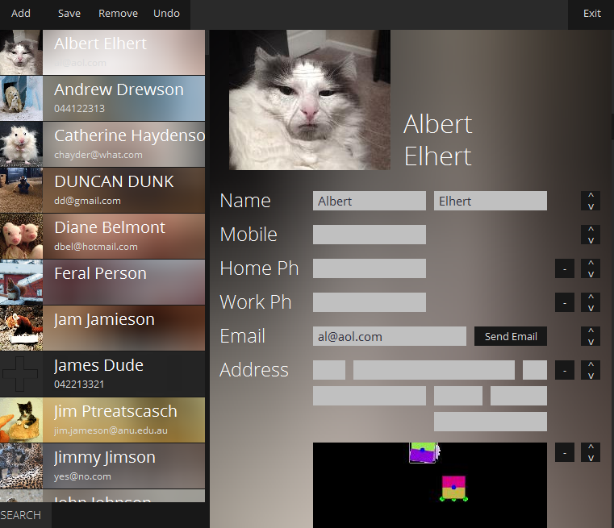

# uni-contacts_org
A simple Java Swing based contacts organiser for a Uni project

Run note: A runnable jar has been included, otherwise the library (Filters.jar in /src/) should be added to the eclipse build path (This library provides the blur filter used, as swing's convolve method of blurring is sub-par to JavaFX's). Library provided by http://www.jhlabs.com/ip/blurring.html

# Design
The project was split into two main packages, Business and GUI, where the business layer handles the back-end data management, and the GUI manages the display of this data to the user. Their interaction only occurs through very generalised interfaces - in this case, the Record interface (Which is an arraylist of attributes, basically a row in a DB).

The class implementing this Record interface is the ContactRecord. However if the requirements were to significantly change, all that would have to be changed is the creation of a new class to extend the Record interface - i.e, one that can be exported into an arraylist of attributes. The ContactRecord simply contains a set of fields and a method to be imported and exported to some format (despite the Factory using XML, it is not neccessary for Records to do so).

The class than manages the saving and loading of these records in the RecordFactory. It contains an arraylist of records, to which it can export into a bespoke-XML format. When this XML is implemented, the classes are dynamically instantiated through java reflection and loaded. The main function of this class is to provide a method to get all records, and to allow the persistent adding and modification of records. Currently, a saving and removing records is an O(n) operation due to parsing the entire file and removing specific lines - however this is the only viable way of doing so without a significant increase in code complexity (i.e, adding indexing/etc). Should requirements change however (e.g, need to handle massive clientele lists), all that needs to be changed is the addRecord() and removeRecord() methods, which could be set to interface with a database.

The GUI interacts only with the RecordFactory, and uses the Record Interface, so changes the the underlying record class will not affect the GUI. This was done to ensure that if requirements were to change in the future (e.g, to store inventory rather than contacts), this could be easily done with the GUI handling it optimally.

From the UML above, the seperation between the business and GUI layers are clear. The only link between the two is the Record Interface - of which acts like a list of attributes. Note that there is no link between the GUI and RecordFactory, despite the GUI using this class. This is because the factory is a static class accessed through the .instance() method and UML does not have static accessors defined.

# Interface
The design of the GUI is a simple two column layout - A pane on the left from which contacts can be selected and a pane on the right displaying the details of these contacts and enabling modification. This is a conventional design, being both straightforward in usage, and convenient. Contacts are sorted alphabetically to allow easy finding (And new contacts are added to the top, and resorted when the program is reloaded to enable easy tracking of what has been done in the user's current use of the program). The top bar is replaced with a custom bar, containing the save, delete, new and exit commands, written in plain text as part of the aesthetic, and to ensure that understanding the program is trivial. A search function has also been added which will allow users to find records rapidly.

This layout is also somewhat responsive (as much as possible in java swing without a major amount of coding to overcome shortcomings), with the design adjusting based on the user's screen width. As such, it would have directly run on mobile without any modification to the code (however java swing is too old for mobile).

Essentially all java swing elements have been re-themed to a modern minimalistic approach - with flat buttons and backgrounds as blurred images. This was done by overriding the swing classes JButtons and JTextField/etc. The entire theme of the program could be changed simply by small modifications to these classes, packaged under ModernUI.

# Testing
## Unit Testing
The main unit tested is the Factory - responsible for the loading and saving of the 'database'. This is because it is the most essential class as well as the least observable. The functions tested are initialize(), add, and remove - the 3 core functions of the factory - each requiring all other methods of the factory (such as importing xml/etc) to function as expected.

A signficant portion of the codebase handles visuals. As such, unit testing is more difficult and arbitrary (e.g, asserting colors is completely pointless, might not even be correct depending on java swing's rendering). Asserting XY locations are also a poor method of determining the UI is rendered correctly, due to swing's inconsistent usage of preferred/actual size/location. 

### Unit Tests
* ContactRecord (main type implementing Record) was tested, ensuring that it could import its own exported data, and that this was done correctly.
* Factory was tested by overriding the static factory class with a TestFactory class - which creates a new test database rather than using the main database to ensure that in the case tests do fail - side effects will not be seen on the main database.
 

## Integration Testing
Integration testing was mainly done to ensure that changes in the GUI itself were reflected to in business layer. A major difficulty in conducting this testing was creating a TestGUI environment such that changes in this environment were not reflected in the main database. In fact, a test to test TestGUI's isolation was created, as for a significant portion of time, this was not the case! (The factory override was not being called on an InvokeLater(), and was hence being overridden by the run() instantiation of the default GUI)

## General Testing
Otherwise, most of the testing (especially in regards to visual aspects) was done by coding and observation. Most classes implemented their respective interfaces, which meant that given that the interface is implemented correctly by the class, the class will function as expected. This enables unit testing to be done on the interface, while instantiating all implementing classes through reflection (Although a number of these classes are GUI-related classes, or simple data container classes where testing would be quite redundant - which is why it is not done here. If the classes were to become more complex, testing will be done). The program was overall designed with few code paths, such that it is easy to test, and behaviour is as expected. This also made for an extremely simple, intuitive UI.

# Extensions
Various extensions were implemented for this program, including:
1. Complete re-theme of Java Swing by overriding all JObjects. Spotify inspired blur (Decent blur effect required external library, as referenced in ImageFilters class). Default menu bar removed, and replaced with a custom bar in both windows and linux (and mac?)
2. Reasonably robust and humanly interpretable database format. New fields can be added to contacts manually by simply creating the correct field type in XML and inputting data. If corruption does occur, methods such as restoring from backups, clearing database, and manual fixing of database given.
3. Custom fields for contacts, add/remove fields. For example, a person can add image fields and more emails for a contact.
4. Simple search box (Given more time, this would have prioritised search results rather than just sorting results alphabetically)
5. Undo record options, save prompts. Automatic backup system.
6. Images, and everything else visually obvious.
